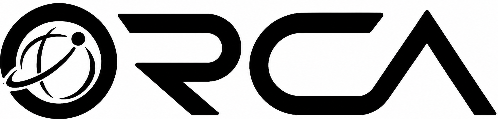
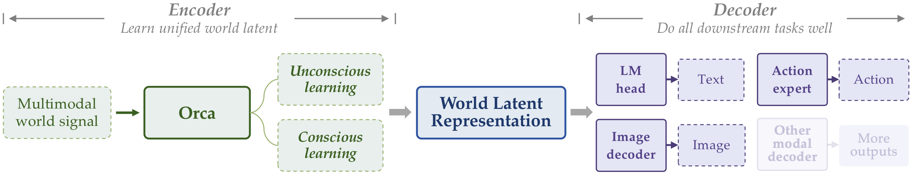
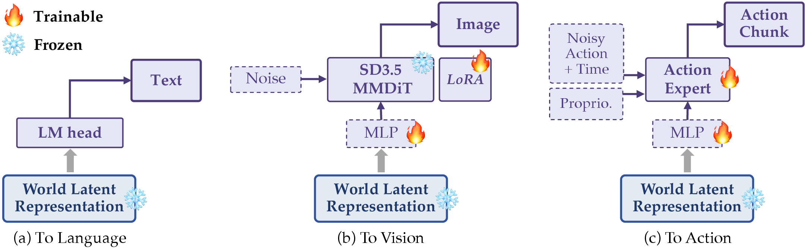
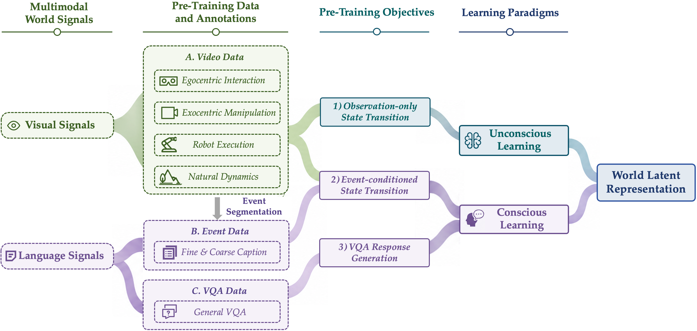
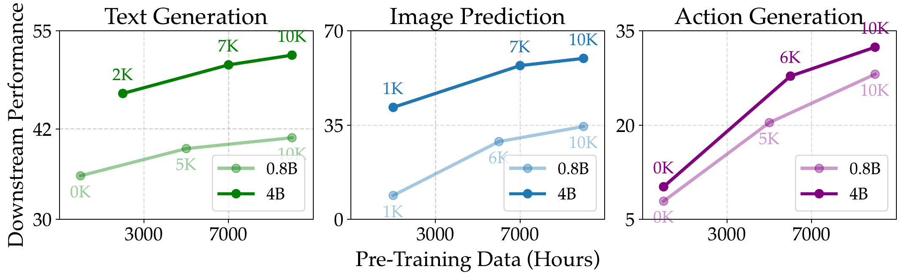

<div align="center">

</div>

<h1 align="center">Orca: The World is in Your Mind</h1>

<p align="center">
  <b>Orca Team, Beijing Academy of Artificial Intelligence</b>
</p>

<p align="center">
  ⭐️ <a href="https://orca-wm.github.io">Project Page</a>
  &nbsp;|&nbsp;
  🤗 <a href="https://huggingface.co/papers/2606.30534">Hugging Face</a>
  &nbsp;|&nbsp;
  📑 <a href="https://arxiv.org/abs/2606.30534">Technical Report</a>
</p>

<p align="center">
  <b>A general world foundation model centered on Next-State-Prediction.</b>
</p>

<p align="center">
  💬 <b>If you have any questions, feel free to contact us via WeChat.</b>
</p>

<div align="center">

</div>

## 🔥 Overview

**Orca** is an initial instantiation of a general world foundation model. It learns a unified world latent space from multimodal world signals and exposes the learned latent through multimodal readout interfaces.

Rather than optimizing isolated **next-token**, **next-frame**, or **next-action** prediction objectives, Orca is centered on **Next-State-Prediction**: a unified state-transition modeling route toward understanding, predicting, and acting upon the world. In this version, Orca focuses on two fundamental input signals: **visual signals** for dense observations of world evolution, and **language signals** for event descriptions, task intentions, causal explanations, and semantic constraints.

- **Unconscious learning**: dense natural transitions from continuous videos.
- **Conscious learning**: sparse meaningful transitions under language-described events and VQA supervision.
- **Frozen-backbone readouts**: lightweight decoders for **text**, **images**, and **actions**.
- **Scaling analysis**: stronger world modeling, stronger downstream readouts.

## 🗞️ News

- **`2026-06-29`**: 🎉 [**Orca Technical Report**](https://arxiv.org/abs/2606.30534) was released.
- **`2026-07-14`**: 🚀 [**Orca-4B**](https://huggingface.co/BAAI/Orca-4B) checkpoint was released on Hugging Face.

## 📆 Todo

- [x] Release the **Orca Technical Report**.
- [x] Release the **Orca-4B checkpoint** for world latent learning and downstream readouts.
- [x] Release **inference code** for text, image, and action readouts.
- [ ] Release the **Orca-0.8B checkpoint** for lightweight research and reproduction.
- [ ] Release **downstream fine-tuning code** for modality-specific readout adaptation.

## ⭐️ Architecture

Orca follows an **Encoder-Decoder** architecture. Given multimodal world signals, the **Encoder** learns a world latent through unconscious and conscious learning. After pre-training, the Encoder is frozen, and only lightweight modality-specific decoders are trained to read out the latent into downstream modalities.

<div align="center">

</div>

<p align="center"><b>Figure 1.</b> Orca learns a unified world latent through unconscious and conscious learning.</p>

<br/>

<div align="center">

</div>

<p align="center"><b>Figure 2.</b> Lightweight readouts adapt frozen world latents to language, vision, and action.</p>

Orca models world-state transitions under both **implicit dynamics** and **explicit conditions**. Implicit dynamics capture latent or unobserved factors such as physical laws, object properties, scene dynamics, and environmental forces, while explicit conditions describe observed signals such as human instructions, event descriptions, task intentions, or causal premises.

## 📚 Data

For pre-training, Orca constructs a large-scale world-learning inventory from **visual signals** and **language signals**. The data mixture includes video data for observation-only state transitions, event data for event-conditioned state transitions, and VQA data for response generation.

- **125K hours** of video data covering egocentric interaction, exocentric manipulation, robot execution, and natural dynamics.
- **160M** event annotations with fine- and coarse-grained captions for event-level transition learning.
- **General VQA data** for aligning world latents with language understanding and response generation.

<div align="center">

</div>

<p align="center"><b>Figure 3.</b> Orca data pipeline from multimodal world signals to world latent learning.</p>

## 🤗 Model Zoo

Available checkpoints are listed below.

| Model | Checkpoint | Description |
| --- | --- | --- |
| Orca-4B | [🤗 BAAI/Orca-4B](https://huggingface.co/BAAI/Orca-4B) | Larger Orca backbone with stronger downstream readout performance. |
| Orca-0.8B | Coming soon | Lightweight Orca backbone for world latent learning. |

## 🔍 Evaluation

Orca is evaluated through three representative downstream readouts: **text generation**, **image prediction**, and **action generation**.

### Text Generation

Text generation evaluates understanding on *TemporalBench*, *MVBench*, *SWITCH*, and *3DSRBench*.

<table align="center" width="100%">
  <tr>
    <th align="center" nowrap>Model</th><th align="center" nowrap>Size (B)</th><th align="center">MVBench ↑</th><th align="center">TemporalBench ↑</th><th align="center">3DSRBench ↑</th><th align="center">SWITCH ↑</th><th align="center">Avg. ↑</th>
  </tr>
  <tr><td align="center" nowrap>Emu3</td><td align="center">8</td><td align="center">35.2</td><td align="center">9.5</td><td align="center">39.1</td><td align="center">38.0</td><td align="center">30.4</td></tr>
  <tr><td align="center" nowrap>Emu3.5</td><td align="center">34</td><td align="center">39.5</td><td align="center">9.5</td><td align="center">31.3</td><td align="center">38.9</td><td align="center">29.8</td></tr>
  <tr><td align="center" nowrap>MiniCPM-V-4.6</td><td align="center">2</td><td align="center">41.4</td><td align="center">21.2</td><td align="center">47.7</td><td align="center">41.2</td><td align="center">37.9</td></tr>
  <tr><td align="center" nowrap>Qwen3.5</td><td align="center">4</td><td align="center"><b>67.1</b></td><td align="center">25.2</td><td align="center">48.1</td><td align="center">42.8</td><td align="center">46.7</td></tr>
  <tr><td align="center" nowrap><b>Orca</b></td><td align="center">0.8</td><td align="center">53.6</td><td align="center">22.6</td><td align="center">43.4</td><td align="center">43.7</td><td align="center">40.8</td></tr>
  <tr><td align="center" nowrap><b>Orca</b></td><td align="center">4</td><td align="center">65.3</td><td align="center"><b>34.2</b></td><td align="center"><b>52.1</b></td><td align="center"><b>55.6</b></td><td align="center"><b>51.8</b></td></tr>
</table>

### Image Prediction

Image prediction evaluates future-state prediction on *PRICE-V0.1* real-world interactions.

The PRICE evaluation toolkit is available in [`evaluation/image_gen/PRICE/`](./evaluation/image_gen/PRICE), and the benchmark data is hosted at [BAAI/PRICE](https://huggingface.co/datasets/BAAI/PRICE).

<table align="center" width="100%">
  <tr>
    <th align="center" nowrap>Model</th><th align="center" nowrap>Size (B)</th><th align="center" nowrap>Gemini 3.1 Pro ↑</th><th align="center" nowrap>GPT 5.4 ↑</th><th align="center" nowrap>Doubao-Seed-2.0 ↑</th><th align="center" nowrap>Gemma 4-31B ↑</th><th align="center">Avg. ↑</th>
  </tr>
  <tr><td align="center" nowrap>OmniGen2</td><td align="center">3+4</td><td align="center">24.6</td><td align="center">46.8</td><td align="center">41.4</td><td align="center">45.5</td><td align="center">39.6±10.2</td></tr>
  <tr><td align="center" nowrap>FLUX.1-Kontext</td><td align="center">12</td><td align="center">21.6</td><td align="center">46.9</td><td align="center">42.7</td><td align="center">52.5</td><td align="center">40.9±13.5</td></tr>
  <tr><td align="center" nowrap>FLUX.2 [klein]</td><td align="center">4+4</td><td align="center">29.7</td><td align="center">64.6</td><td align="center">60.0</td><td align="center"><b>70.2</b></td><td align="center">56.1±18.1</td></tr>
  <tr><td align="center" nowrap><b>Orca</b></td><td align="center">0.8+2</td><td align="center">17.0</td><td align="center">48.5</td><td align="center">46.0</td><td align="center">26.5</td><td align="center">34.5±15.3</td></tr>
  <tr><td align="center" nowrap><b>Orca</b></td><td align="center">4+2</td><td align="center"><b>44.0</b></td><td align="center"><b>67.9</b></td><td align="center"><b>61.0</b></td><td align="center">66.3</td><td align="center"><b>59.8±10.9</b></td></tr>
</table>

### Action Generation

Action generation evaluates five real-robot manipulation tasks under *environment* and *object OOD* settings.

<table align="center" width="100%">
  <tr>
    <th align="center" nowrap>Model</th><th align="center">Rule ↑</th><th align="center">M25 ↑</th><th align="center">M50 ↑</th><th align="center">SR ↑</th><th align="center">MaxP-F ↑</th><th align="center">FNS ↑</th><th align="center">RBS ↑</th><th align="center">SQS ↑</th>
  </tr>
  <tr><td align="center" nowrap>V-JEPA 2.1</td><td align="center">17.0</td><td align="center">27</td><td align="center">7</td><td align="center">0</td><td align="center">17.4</td><td align="center">10.1</td><td align="center">20.5</td><td align="center">0.0</td></tr>
  <tr><td align="center" nowrap>Qwen3.5</td><td align="center">10.5</td><td align="center">18</td><td align="center">5</td><td align="center">0</td><td align="center">13.1</td><td align="center">7.6</td><td align="center">11.9</td><td align="center">0.0</td></tr>
  <tr><td align="center" nowrap>pi0.5</td><td align="center">29.4</td><td align="center">54</td><td align="center"><b>14</b></td><td align="center">5</td><td align="center">26.5</td><td align="center"><b>15.3</b></td><td align="center">26.7</td><td align="center"><b>3.0</b></td></tr>
  <tr><td align="center" nowrap><b>Orca</b></td><td align="center"><b>32.4</b></td><td align="center"><b>55</b></td><td align="center"><b>14</b></td><td align="center"><b>6</b></td><td align="center"><b>27.9</b></td><td align="center">15.1</td><td align="center"><b>30.3</b></td><td align="center">2.9</td></tr>
</table>

<sub>M25/M50: trajectories reaching 25%/50% milestones; SR: success rate; MaxP-F: max process in failed trials; FNS: failure near-success score; RBS: robustness score; SQS: success quality score.</sub>

### Scaling Behavior

<div align="center">

</div>

<p align="center"><b>Figure 4.</b> Downstream readout performance improves as Orca pre-training scales.</p>

Experiments indicate that stronger world latents from pre-training lead to stronger downstream readouts. As pre-training scales up, Orca improves across text, image, and action readouts while keeping the backbone frozen during readout post-training.

## 🛠️ Usage

The current release provides the [🤗 BAAI/Orca-4B](https://huggingface.co/BAAI/Orca-4B) checkpoint and evaluation code for image and text generation.

Clone the repository and install the shared dataset downloader:

```bash
git clone https://github.com/orca-wm/Orca.git
cd Orca/evaluation
python -m pip install -r requirements-data.txt
```

Download evaluation datasets into `evaluation/data/`:

```bash
python download_datasets.py price
python download_datasets.py switch
python download_datasets.py mvbench
python download_datasets.py temporalbench
python download_datasets.py 3dsrbench
```

See the task-specific instructions for model setup and evaluation:

- [PRICE image-generation evaluation](./evaluation/image_gen/PRICE)
- [Text-generation evaluation](./evaluation/text_gen)
- [Complete evaluation and dataset setup](./evaluation)

## 📑 Citation

If you find Orca useful for your research, please consider citing our technical report.

```bibtex
@article{orca2026,
  title={Orca: The World is in Your Mind},
  author={Yihao Wang and Yuheng Ji and Mingyu Cao and Yanqing Shen and Runze Xiao and Huaihai Lyu and Senwei Xie and Euan Liu and Klara Tian and Tianfeng Long and Yichi Zhang and Zhengliang Cai and Ruike Chen and Jifan Zhao and Ruochuan Shi and Zihan Tang and Jing Lyu and Wenxing Tan and Ningbo Zhang and Yangtao Hu and Yuming Gao and Xiansheng Chen and Junkai Zhao and Congsheng Xu and Boan Zhu and Ziqi Wang and Yupu Feng and Qiongqiong Zhang and Yingli Zhao and Yulong Ao and Shaoxuan Xie and You Liu and Guocai Yao and Leiduo Zhang and Xiaodan Liu and Yunyan Zhang and Yance Jiao and Xinyan Yang and Jiaxing Wei and Xu Liu and Tengfei Pan and Shaokai Nie and Chunlei Men and Sen Cui and Xiaojie Jin and Hongyang Li and Jianlan Luo and Yao Mu and Yunchao Wei and Jun Yan and Hang Zhao and Xiaolong Zheng and Jiaming Li and Yonghua Lin and Tiejun Huang and Zhongyuan Wang and Pengwei Wang},
  journal={arXiv preprint arXiv:2606.30534},
  year={2026}
}
```
