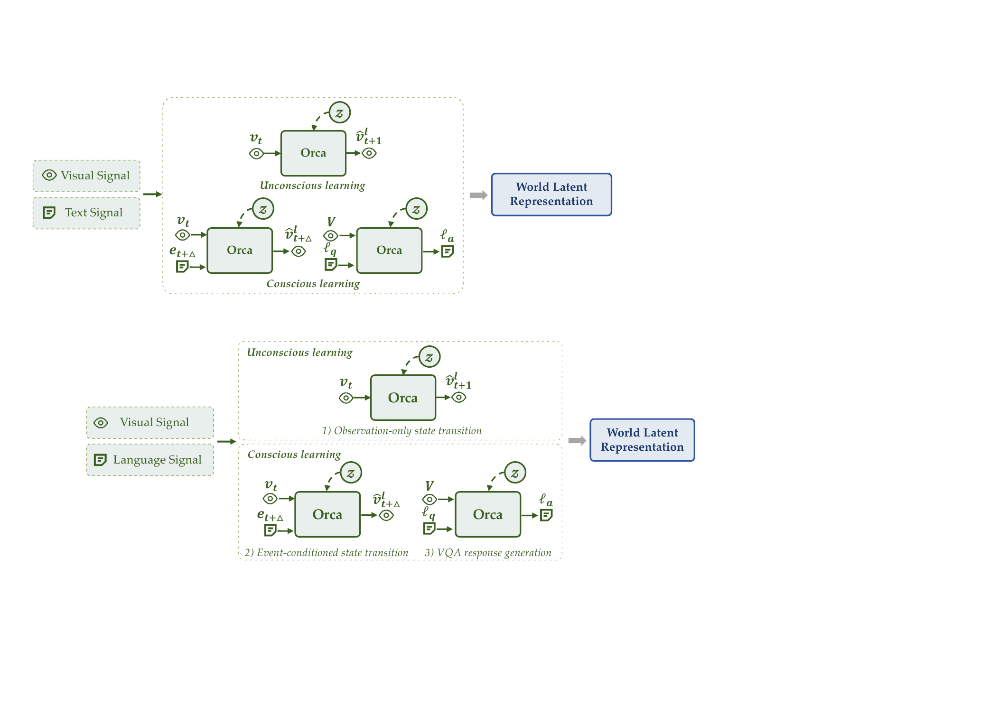

<div align="center">

</div>

<h1 align="center">Orca: The World is in Your Mind</h1>

<p align="center">
  <b>Orca Team, Beijing Academy of Artificial Intelligence</b>
</p>

<p align="center">
  ⭐️ <a href="https://orca-wm.github.io">Project Page</a>
  &nbsp;|&nbsp;
  🤗 <a href="https://huggingface.co/papers/2606.30534">Hugging Face</a>
  &nbsp;|&nbsp;
  📑 <a href="https://arxiv.org/abs/2606.30534">Technical Report</a>
</p>

<p align="center">
  <b>A general world foundation model centered on Next-State-Prediction.</b>
</p>

<p align="center">
  💬 <b>If you have any questions, feel free to contact us via WeChat.</b>
</p>

<div align="center">

</div>

## 🔥 Overview

**Orca** is an initial instantiation of a general world foundation model. It learns a unified world latent space from multimodal world signals and exposes the learned latent through multimodal readout interfaces.

Rather than optimizing isolated **next-token**, **next-frame**, or **next-action** prediction objectives, Orca is centered on **Next-State-Prediction**: a unified state-transition modeling route toward understanding, predicting, and acting upon the world. In this version, Orca focuses on two fundamental input signals: **visual signals** for dense observations of world evolution, and **language signals** for event descriptions, task intentions, causal explanations, and semantic constraints.

- **Unconscious learning**: dense natural transitions from continuous videos.
- **Conscious learning**: sparse meaningful transitions under language-described events and VQA supervision.
- **Frozen-backbone readouts**: lightweight decoders for **text**, **images**, and **actions**.
- **Scaling analysis**: stronger world modeling, stronger downstream readouts.

## 🗞️ News

- **`2026-06-29`**: 🎉 [**Orca Technical Report**](https://arxiv.org/abs/2606.30534) was released.

## 📆 Todo

- [x] Release the **Orca Technical Report**.
- [ ] Release the **Orca-4B checkpoint** for world latent learning and downstream readouts.
- [ ] Release the **Orca-0.8B checkpoint** for lightweight research and reproduction.
- [ ] Release **inference code** for text, image, and action readouts.
- [ ] Release **downstream fine-tuning code** for modality-specific readout adaptation.

## ⭐️ Architecture

Orca follows an **Encoder-Decoder** architecture. Given multimodal world signals, the **Encoder** learns a world latent through unconscious and conscious learning. After pre-training, the Encoder is frozen, and only lightweight modality-specific decoders are trained to read out the latent into downstream modalities.

<div align="center">

</div>

The state transition process can be understood as modeling how a latent world state evolves forward or backward under:

- **Implicit dynamics**, such as physical laws, object properties, scene dynamics, and environmental forces.
- **Explicit conditions**, such as human instructions, event descriptions, task intentions, or causal premises.

## 📚 Data

For pre-training, Orca constructs a large-scale world-learning inventory with:

- **125K hours** of video data.
- **160M** event annotations.
- Coverage over ego-centric interaction, exo-centric manipulation, action-free robot execution, and event-level transitions.

## 🔍 Evaluation

Orca is evaluated through three representative downstream readouts:

- **Text generation** for out-of-distribution commonsense reasoning, comprehension, and high-level cognitive abilities.
- **Image prediction** for visualizing state transitions in out-of-distribution scenarios.
- **Action generation** for executing generated actions in real-world out-of-distribution settings.

<div align="center">

</div>

Experiments indicate that stronger world latents from pre-training lead to stronger downstream readouts. As pre-training scales up, Orca improves across text, image, and action readouts while keeping the backbone frozen during readout post-training.

## 🤗 Model Zoo

Model links will be added after release.

| Model | Checkpoint | Description |
| --- | --- | --- |
| Orca-0.8B | Coming soon | Lightweight Orca backbone for world latent learning. |
| Orca-4B | Coming soon | Larger Orca backbone with stronger downstream readout performance. |

## 🛠️ Usage

Code, checkpoints, and inference examples will be released soon.

```bash
git clone git@github.com:orca-wm/Orca.git
cd Orca
```

## 📑 Citation

If you find Orca useful for your research, please consider citing our technical report. Citation information will be updated after the report is released.

```bibtex
@article{orca2026world,
  title={Orca: The World is in Your Mind},
  author={Orca Team, Beijing Academy of Artificial Intelligence},
  journal={Technical Report},
  year={2026}
}
```
